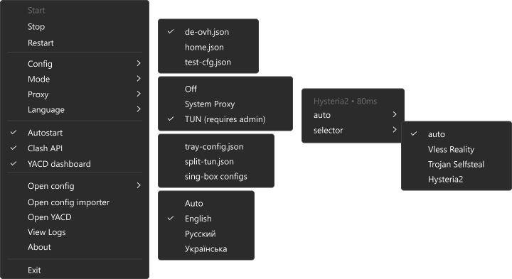

# sing-box-tray

[![release][badge-version]][releases] [![license][badge-license]][license]
[![downloads][badge-downloads]][releases] [![github stars][badge-stars]][repo]


A [sing-box](https://github.com/sagernet/sing-box) tray launcher for Windows. Made with idea "Less UI, more UX".  
Thin sing-box client without magic, direct access to core & real configs.

Most GUI clients put a settings screen between you and the config. Editing gets harder, and you can only change what they decided to expose. A button rarely says what it actually does.  
This tray stays out of the way: the config is the sing-box file you wrote, and it is never rewritten. The menu is a fast way to drive the core.  
Built for people who want a transparent client.



## Quick start

Windows 10/11 x64. From PowerShell:

```powershell
irm https://raw.githubusercontent.com/Be1zebub/sing-box-tray/main/scripts/install.ps1 | iex
```

From Git Bash:

```sh
curl -fsSL https://raw.githubusercontent.com/Be1zebub/sing-box-tray/main/scripts/install.sh | bash
```

From a clone: `powershell -NoProfile -ExecutionPolicy Bypass -File .\scripts\install.ps1` or `./scripts/install.sh`.
Pass a directory to install somewhere else (`-Dest D:\apps\sing-box-tray`, or the first argument of the bash script).
The default folder is `.\sing-box-tray`.

```
sing-box-tray/
  sing-box-tray.exe
  config-importer.exe
  config.json            # tray settings
  split-tun.json         # TUN split rules
  configs/               # your sing-box configs
  deps/
    sing-box.exe
    wintun.dll
```

Put your sing-box config in `configs\` (you can use config importer) and start `sing-box-tray.exe`.
Run the script again to update the binaries. `config.json`, `split-tun.json`, and `configs\` stay as they are.

The tray itself never downloads anything. The install script is the only thing that talks to GitHub, sing-box releases, and wintun.net.

## The fork

It started because upstream shipped an auto-updater. That was a supply-chain surface: self-replacement of the running exe, silent updates on by default, a logon task at highest privileges, mutable CI tags publishing the release, and an unverified `wintun.dll` loaded into an elevated process. Those paths are gone. A missing `sing-box.exe` or `wintun.dll` is reported, not fetched. There is no updater.

That was only the reason to start. I liked the project and stayed with it. It has grown since, and I keep improving it and adding features.

## What it does

Off, System Proxy, and TUN. TUN asks for admin. The sing-box file you wrote is never rewritten.

Configs live in `configs\`. `split-tun.json` next to the exe is TUN-only: blacklist skips the tunnel, whitelist is the only traffic that uses it.

Config importer, from the menu, builds a config from a subscription or from links. That tool uses the network. The tray does not.

Logs and About open in Windows Terminal.

## Building

Go only. `CGO_ENABLED=0`. No C compiler.

```sh
make build                 # tray
make build-importer        # config-importer.exe
./scripts/build.sh         # Linux, macOS, WSL
scripts\build.ps1          # Windows
```

Output is `build/sing-box-tray.exe`. `VERSION=v1.2.3 ./scripts/build.sh` embeds that version. A local build without `VERSION` uses `git describe`.

`rsrc.syso` embeds `app.manifest` and `assets/icons/working.ico`. Regenerate it if either changes:

```sh
go install github.com/akavel/rsrc@latest
rsrc -manifest app.manifest -ico assets/icons/working.ico -o rsrc.syso
```

Pushing a `v*` tag builds the tray and `config-importer.exe` and publishes both on the GitHub release.

## License

MIT — see [LICENSE](LICENSE).

[badge-version]: https://img.shields.io/github/v/release/Be1zebub/sing-box-tray
[badge-license]: https://img.shields.io/github/license/Be1zebub/sing-box-tray
[badge-downloads]: https://img.shields.io/github/downloads/Be1zebub/sing-box-tray/total
[badge-stars]: https://img.shields.io/github/stars/Be1zebub/sing-box-tray.svg?style=flat&logo=github
[releases]: https://github.com/Be1zebub/sing-box-tray/releases
[license]: https://github.com/Be1zebub/sing-box-tray/blob/main/LICENSE
[repo]: https://github.com/Be1zebub/sing-box-tray
